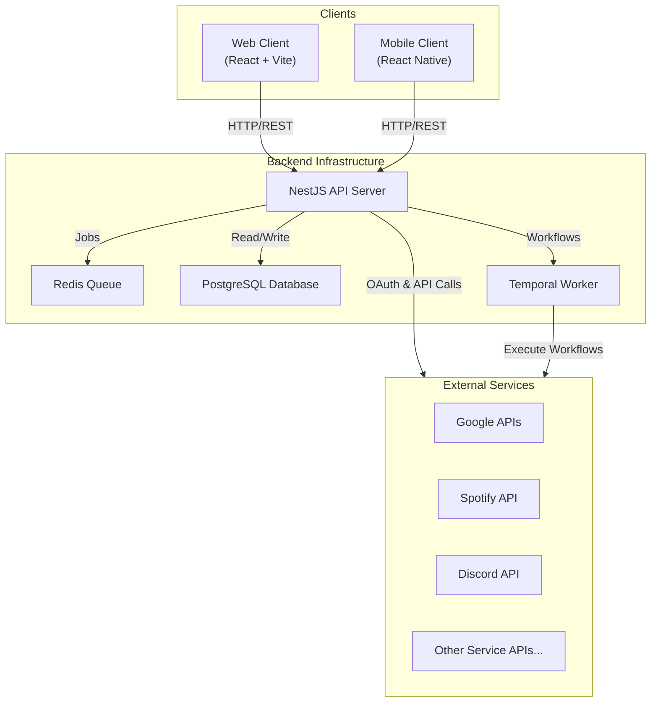

# AREA - Automation Platform

> **A comprehensive automation platform connecting your favorite services.**

Welcome to the **AREA** project! This repository contains a powerful automation platform that allows you to trigger actions based on specific events across various services like Discord, Spotify, Google, and more. It features a robust NestJS backend, a modern React web client, and a React Native mobile client.

## Documentation Navigation

This project is documented extensively. Please refer to the following sections for deep dives into specific components:

- **[Backend Documentation](./docs/backend/README.md)**: Architecture, Services, Auth, and Workflows.
- **[Web Client Documentation](./docs/client_web/README.md)**: Components, Routing, and State.
- **[Mobile Client Documentation](./docs/client_mobile/README.md)**: Screens and Navigation.
- **[API Documentation](./docs/backend/api.md)**: Detailed API endpoints and usage.

## Architecture and Design

We chose a modern, scalable technology stack to ensure performance, maintainability, and extensibility.

### Why NestJS?
NestJS provides a robust, modular architecture out-of-the-box. Its dependency injection system and TypeScript support make it ideal for building complex, scalable server-side applications. It organizes code into modules (Services, Controllers, Gateways), ensuring clean separation of concerns.

### Why Temporal?
Automation workflows are long-running processes that can fail at any step (e.g., API downtime). Temporal guarantees durable execution. If the server crashes or an API is temporarily unavailable, Temporal remembers the state and retries the specific activity without losing data, making our automation engine incredibly reliable.

### Why PostgreSQL & Redis?
- **PostgreSQL**: A powerful, strictly typed relational database that ensures data integrity for our Users, Workflows, and Credentials schemas.
- **Redis**: Used as a high-performance job queue and cache, essential for handling the high throughput of polling triggers and background tasks.

### Why React & React Native?
Using **React** (Web) and **React Native** (Mobile) allows us to share business logic, hooks, and types between platforms. The component-based architecture ensures a consistent UI/UX across all devices, while strict typing (TypeScript) across the entire stack prevents runtime errors.

## Global Architecture

The following diagram illustrates the high-level architecture of the AREA platform, showing how the different clients interact with the backend and how the backend orchestrates services and database interactions.



## Quick Start

Follow these instructions to get the project up and running on your local machine.

### Prerequisites

- **Docker** and **Docker Compose** installed.
- **Node.js** (LTS version) and **pnpm** installed.

### Installation & Execution

1.  **Clone the repository:**
    ```bash
    git clone https://github.com/YourOrg/area.git
    cd area
    ```

2.  **Environment Setup:**
    Duplicate the example environment file and configure your keys.
    ```bash
    cp .env.example .env
    ```
    > **Note:** You will need valid API keys for Google, Spotify, etc., to fully test all integrations.

3.  **Start with Docker Compose:**
    This will start the Database, Redis, Temporal, and the Backend API.
    ```bash
    docker-compose up -d --build
    ```

4.  **Run Clients:**
    *   **Web Client**:
        ```bash
        cd client_web
        pnpm install
        pnpm dev
        ```
    *   **Mobile Client** (Android/iOS):
        ```bash
        cd client_mobile
        pnpm install
        pnpm start
        ```

## Tech Stack

- **Backend**: NestJS, TypeScript, Temporal.io, PostgreSQL, Redis.
- **Frontend (Web)**: React, Vite, TailwindCSS, TanStack Query.
- **Frontend (Mobile)**: React Native, Expo.
- **DevOps**: Docker, Docker Compose.


