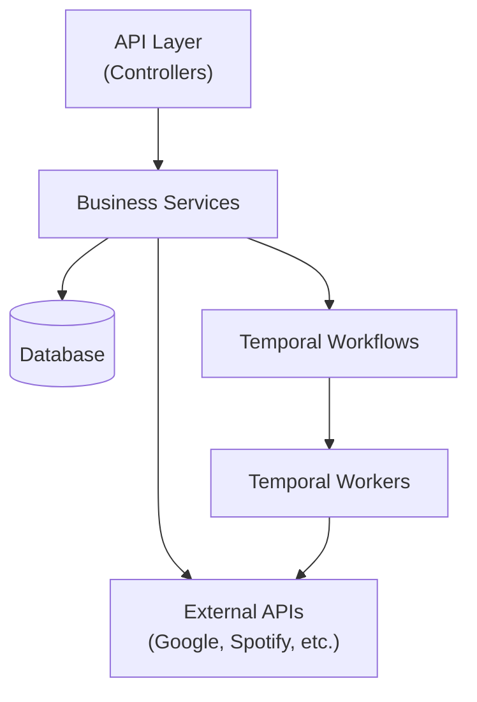

# Backend Documentation

> **Detailed documentation for the NestJS Backend API.**

The **AREA Backend** is the core of the automation platform, built with **NestJS**. It handles all business logic, manages service integrations, orchestrates workflows using **Temporal**, and serves the API for both web and mobile clients.

## Tech Stack

- **Framework**: [NestJS](https://nestjs.com/) (TypeScript)
- **Database**: PostgreSQL (via TypeORM or Drizzle)
- **Workflow Engine**: [Temporal.io](https://temporal.io/) (for reliable execution)
- **Queue**: Redis (for job processing)
- **Authentication**: Passport Strategy (OAuth2)

## Architecture Overview

The backend is organized into modular services.

### Key Directories

- `src/api`: Controllers and DTOs exposing the REST API.
- `src/services`: Service integrations (Discord, Google, Spotify, etc.).
- `src/db`: Database schemas and migration configurations.
- `src/temporal`: Temporal client and workflow definitions.

## Detailed Documentation

Navigate to the detailed documentation for specific components:

- **[Services & Integrations](./services.md)**: Exhaustive list of all supported triggers and actions (Spotify, Google, etc.).
- **[Authentication Flow](./auth.md)**: How OAuth2 and JWTs are handled.
- **[Workflows Engine](./workflows.md)**: Deep dive into Temporal integration.
- **[API Reference](./api.md)**: Endpoints and payload details.
