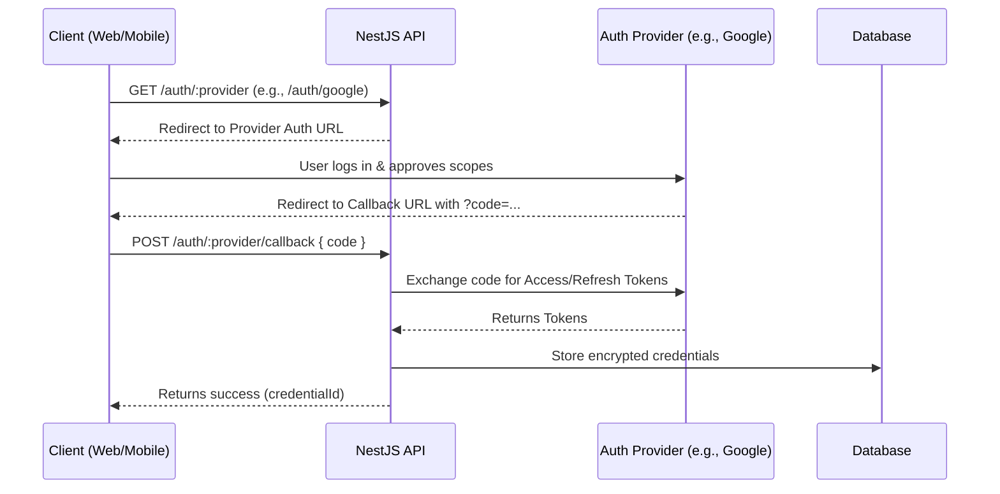

# Authentication & Credentials

> **Secure access management using OAuth2 strategies.**

The AREA platform uses **Passport.js** and **OAuth2** to authenticate users with external services (Google, Spotify, Discord, etc.) and manage their credentials.

## OAuth2 Flow

The authentication process follows a standard OAuth2 Authorization Code flow.

## Security

- **Encryption**: Tokens are encrypted before storage using AES-256 (via the `vault` module or environment secrets).
- **Refresh Mechanisms**: The `OAuth2Service` automatically handles token refreshing when accessing services, ensuring workflows don't fail due to expired tokens.

## Credential Management

User credentials are stored in the `credentials` table. A user can have multiple credentials for different providers (or even multiple for the same provider).

### Endpoints

- `GET /oauth2/credentials`: List all connected accounts.
- `DELETE /oauth2/credentials/:id`: Remove a connected account.
