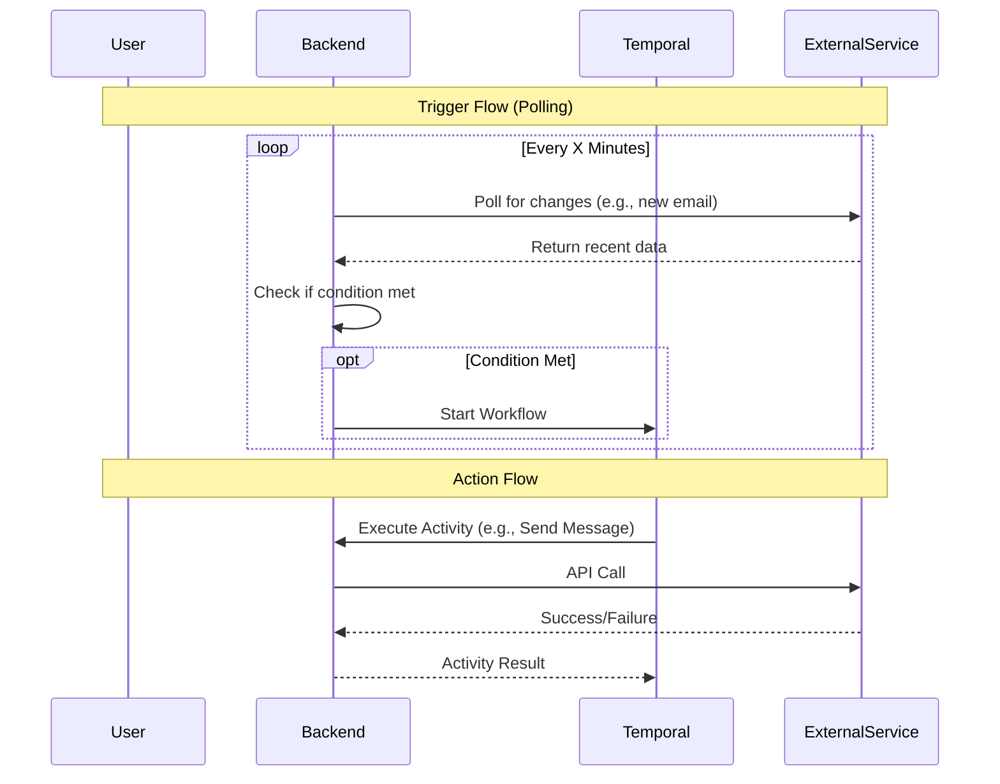

# Services & Integrations

> **Exhaustive list of all services, triggers, and actions available in the AREA platform.**

This document provides a detailed breakdown of every service integration, specifying the available triggers (what starts a workflow) and actions (what happens in a workflow).

## Architecture

Each service is an isolated module in the NestJS application. They communicate with external APIs using OAuth2 credentials stored securely.

---

## Spotify

Integration with Spotify for music automation.

**Authentication**: OAuth2 (Scopes: `user-read-playback-state`, `user-modify-playback-state`, `playlist-read-private`, `playlist-modify-public`).

### Triggers
Events that can start a workflow.

| ID | Name | Description | Output Data |
| :--- | :--- | :--- | :--- |
| `new_track_played` | **New Track Played** | Triggers when the user plays a new track. | `trackId`, `trackName`, `artistName`, `album`, `uri` |
| `new_liked_song` | **New Liked Song** | Triggers when the user likes a song. | `trackId`, `trackName`, `artistName`, `uri` |

### Actions
Operations that can be performed.

| ID | Name | Description | Inputs |
| :--- | :--- | :--- | :--- |
| `play_music` | **Play Music** | Plays a specific track. | `trackUri` |
| `add_to_playlist` | **Add to Playlist** | Adds a track to a playlist. | `playlistId`, `trackUri` |
| `create_playlist` | **Create Playlist** | Creates a new playlist. | `name`, `description` |
| `skip_track` | **Skip Track** | Skips to the next track. | *None* |
| `pause_playback` | **Pause Playback** | Pauses the current playback. | *None* |
| `like_current_track`| **Like Current Track**| Likes the currently playing track.| *None* |

---

## Discord

Integration with Discord for community management and notifications.

### Actions

| ID | Name | Description | Inputs |
| :--- | :--- | :--- | :--- |
| `send_webhook` | **Send Webhook** | Sends a message via a webhook URL. | `webhookUrl`, `content`, `username` (optional), `avatarUrl` (optional) |

---

## Gmail

Manage emails automatically.

**Authentication**: Google OAuth2.

### Triggers

| ID | Name | Description |
| :--- | :--- | :--- |
| `receive_email` | **Receive Email** | Triggers when a new email is received matching criteria. |

### Actions

| ID | Name | Description |
| :--- | :--- | :--- |
| `send_email` | **Send Email** | Sends an email to a recipient. |
| `read_email` | **Read Email** | Marks an email as read or fetches details. |

---

## Google Calendar

Schedule management integration.

### Triggers

| ID | Name | Description |
| :--- | :--- | :--- |
| `new_event` | **New Event** | Triggers when a new event is created on the calendar. |
| `event_cancelled` | **Event Cancelled** | Triggers when a calendar event is cancelled. |

### Actions

| ID | Name | Description |
| :--- | :--- | :--- |
| `create_event` | **Create Event** | Creates a new event on the calendar. |
| `quick_add` | **Quick Add Event** | Adds an event using natural language processing. |

---

## Google Sheets

Data manipulation in spreadsheets.

### Actions

| ID | Name | Description |
| :--- | :--- | :--- |
| `add_row` | **Add Row** | Appends a new row of data to a spreadsheet. |
| `create_spreadsheet`| **Create Spreadsheet**| Creates a brand new Google Sheet. |
| `other_actions` | **Other Actions** | Additional manipulation references. |

---

## Telegram

Bot integration for Telegram messaging.

### Triggers

| ID | Name | Description |
| :--- | :--- | :--- |
| `on_message` | **On Message** | Triggers when the bot receives a text message. |
| `on_command` | **On Command** | Triggers on specific slash commands (e.g., `/start`). |
| `on_new_member` | **New Member** | Triggers when a user joins the group. |
| `on_voice_message`| **Voice Message** | Triggers on receiving a voice note. |
| `on_video_message`| **Video Message** | Triggers on receiving a video note. |
| `on_reply_message`| **Reply Message** | Triggers when a user replies to a message. |
| `on_start_dm` | **Start DM** | Triggers when a user starts a DM with the bot. |

### Actions

| ID | Name | Description |
| :--- | :--- | :--- |
| `send_message` | **Send Message** | Sends a text message to a chat. |
| `send_photo` | **Send Photo** | Sends a photo to a chat. |
| `pin_message` | **Pin Message** | Pins a specific message in a chat. |
| `kick_member` | **Kick Member** | Kicks a user from a group. |
| `unban_member` | **Unban Member** | Unbans a user from a group. |

---

## Twitch

Streaming platform integration.

### Triggers

| ID | Name | Description |
| :--- | :--- | :--- |
| `twitch_triggers` | **Twitch Triggers** | Monitor stream status, new followers, etc. |

### Actions

| ID | Name | Description |
| :--- | :--- | :--- |
| `twitch_actions` | **Twitch Actions** | Interact with chat, update stream info, etc. |

---

## YouTube

Video platform integration.

### Triggers

| ID | Name | Description |
| :--- | :--- | :--- |
| `youtube_triggers`| **YouTube Triggers**| Monitor new videos, subscribers, etc. |

### Actions

| ID | Name | Description |
| :--- | :--- | :--- |
| `youtube_actions` | **YouTube Actions** | Comment, like, or upload videos. |

---

## Scheduler

Time-based triggers.

### Triggers

| ID | Name | Description |
| :--- | :--- | :--- |
| `cron` | **Cron Expression** | Triggers based on a cron schedule (e.g., "Every Friday at 5pm"). |
| `on_activation` | **On Activation** | Triggers immediately when the workflow is activated. |

---

## Webhooks

Generic webhook integration.

### Triggers

| ID | Name | Description |
| :--- | :--- | :--- |
| `public_webhook` | **Inbound Webhook** | Provides a unique URL. Triggers when that URL receives a request. |
