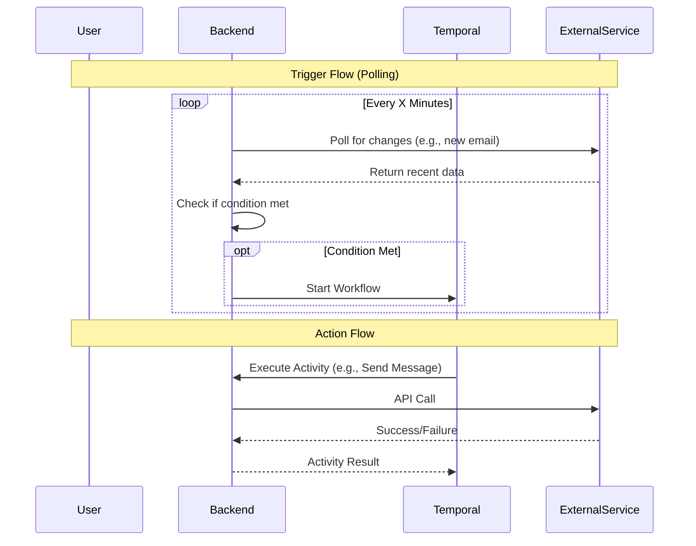

# Services & Integrations

> **Exhaustive list of all services, triggers, and actions available in the AREA platform.**

This document provides a detailed breakdown of every service integration, specifying the available triggers (what starts a workflow) and actions (what happens in a workflow).

## Architecture

Each service is an isolated module in the NestJS application. They communicate with external APIs using OAuth2 credentials stored securely.

## Platform Statistics

| Service | Triggers | Actions | Total Features |
| :--- | :---: | :---: | :---: |
| **Spotify** | 2 | 6 | 8 |
| **Discord** | 0 | 1 | 1 |
| **Gmail** | 1 | 2 | 3 |
| **Google Calendar** | 2 | 2 | 4 |
| **Google Sheets** | 0 | 8 | 8 |
| **Telegram** | 9 | 5 | 14 |
| **Twitch** | 4 | 6 | 10 |
| **YouTube** | 2 | 6 | 8 |
| **Scheduler** | 2 | 0 | 2 |
| **Webhooks** | 1 | 0 | 1 |
| **TOTAL** | **23** | **36** | **59** |

---

## Spotify (2 Triggers, 6 Actions)

Integration with Spotify for music automation.

**Authentication**: OAuth2 (Scopes: `user-read-playback-state`, `user-modify-playback-state`, `playlist-read-private`, `playlist-modify-public`).

### Triggers
Events that can start a workflow.

| ID | Name | Description | Output Data |
| :--- | :--- | :--- | :--- |
| `new_track_played` | **New Track Played** | Triggers when the user plays a new track. | `trackId`, `trackName`, `artistName`, `album`, `uri` |
| `new_liked_song` | **New Liked Song** | Triggers when the user likes a song. | `trackId`, `trackName`, `artistName`, `uri` |

### Actions
Operations that can be performed.

| ID | Name | Description | Inputs |
| :--- | :--- | :--- | :--- |
| `play_music` | **Play Music** | Plays a specific track. | `trackUri` |
| `add_to_playlist` | **Add to Playlist** | Adds a track to a playlist. | `playlistId`, `trackUri` |
| `create_playlist` | **Create Playlist** | Creates a new playlist. | `name`, `description` |
| `skip_track` | **Skip Track** | Skips to the next track. | *None* |
| `pause_playback` | **Pause Playback** | Pauses the current playback. | *None* |
| `like_current_track`| **Like Current Track**| Likes the currently playing track.| *None* |

---

## Discord (0 Triggers, 1 Action)

Integration with Discord for community management and notifications.

### Actions

| ID | Name | Description | Inputs |
| :--- | :--- | :--- | :--- |
| `send_webhook` | **Send Webhook** | Sends a message via a webhook URL. | `webhookUrl`, `content`, `username` (optional), `avatarUrl` (optional) |

---

## Gmail (1 Trigger, 2 Actions)

Manage emails automatically.

**Authentication**: Google OAuth2.

### Triggers

| ID | Name | Description |
| :--- | :--- | :--- |
| `receive_email` | **Receive Email** | Triggers when a new email is received matching criteria. |

### Actions

| ID | Name | Description |
| :--- | :--- | :--- |
| `send_email` | **Send Email** | Sends an email to a recipient. |
| `read_email` | **Read Email** | Marks an email as read or fetches details. |

---

## Google Calendar (2 Triggers, 2 Actions)

Schedule management integration.

### Triggers

| ID | Name | Description |
| :--- | :--- | :--- |
| `new_event` | **New Event** | Triggers when a new event is created on the calendar. |
| `event_cancelled` | **Event Cancelled** | Triggers when a calendar event is cancelled. |

### Actions

| ID | Name | Description |
| :--- | :--- | :--- |
| `create_event` | **Create Event** | Creates a new event on the calendar. |
| `quick_add` | **Quick Add Event** | Adds an event using natural language processing. |

---

## Google Sheets (0 Triggers, 8 Actions)

Data manipulation in spreadsheets.

### Actions

| ID | Name | Description | Inputs |
| :--- | :--- | :--- | :--- |
| `add_row` | **Add Row** | Appends a new row of data to a spreadsheet. | `spreadsheetId`, `range`, `values` |
| `create_spreadsheet`| **Create Spreadsheet**| Creates a brand new Google Sheet. | `title` |
| `write_in_cell` | **Write in Cell** | Updates a cell value. | `spreadsheetId`, `range`, `value` |
| `create_sheet` | **Create Sheet** | Adds a new sheet/tab. | `spreadsheetId`, `sheetTitle` |
| `clear_in_range` | **Clear Range** | Clears values in a range. | `spreadsheetId`, `range` |
| `duplicate_sheet` | **Duplicate Spreadsheet**| Duplicates a spreadsheet file. | `spreadsheetId`, `newTitle` |
| `find_to_replace` | **Find and Replace** | Finds and replaces text. | `spreadsheetId`, `find`, `replacement`, `sheetId` |
| `sort_data_in_range`| **Sort Range** | Sorts a range of data. | `spreadsheetId`, `range`, `sortColumn`, `ascending` |

---

## Telegram (9 Triggers, 5 Actions)

Bot integration for Telegram messaging.

### Triggers

| ID | Name | Description |
| :--- | :--- | :--- |
| `on_message` | **On Message** | Triggers when the bot receives a text message. |
| `on_command` | **On Command** | Triggers on specific slash commands (e.g., `/start`). |
| `on_new_member` | **New Member** | Triggers when a user joins the group. |
| `on_voice_message`| **Voice Message** | Triggers on receiving a voice note. |
| `on_video_message`| **Video Message** | Triggers on receiving a video note. |
| `on_reply_message`| **Reply Message** | Triggers when a user replies to a message. |
| `on_start_dm` | **Start DM** | Triggers when a user starts a DM with the bot. |
| `on_pinned_message`| **Pinned Message** | Triggers when a message is pinned in a chat. |
| `on_message_edited`| **Message Edited** | Triggers when a message is edited. |

### Actions

| ID | Name | Description |
| :--- | :--- | :--- |
| `send_message` | **Send Message** | Sends a text message to a chat. |
| `send_photo` | **Send Photo** | Sends a photo to a chat. |
| `pin_message` | **Pin Message** | Pins a specific message in a chat. |
| `kick_member` | **Kick Member** | Kicks a user from a group. |
| `unban_member` | **Unban Member** | Unbans a user from a group. |

---

## Twitch (4 Triggers, 6 Actions)

Streaming platform integration.

### Triggers

| ID | Name | Description | Output Data |
| :--- | :--- | :--- | :--- |
| `stream_started` | **Stream Started** | Triggers when the stream starts. | `startedAt`, `title` |
| `stream_ended` | **Stream Ended** | Triggers when the stream ends. | `endedAt` |
| `new_follower` | **New Follower** | Triggers when the channel gets a new follower. | `followerName`, `followerId`, `followedAt` |
| `viewer_count_threshold`| **Viewer Count Threshold**| Triggers when viewer count exceeds a value.| `viewerCount` |

### Actions

| ID | Name | Description | Inputs |
| :--- | :--- | :--- | :--- |
| `update_stream_title`| **Update Stream Title**| Updates the channel's stream title. | `title` |
| `update_stream_game` | **Update Stream Game** | Updates the channel's game/category. | `gameName` |
| `send_chat_message` | **Send Chat Message** | Sends a message to the chat. | `message` |
| `create_clip` | **Create Clip** | Creates a clip of the stream. | `hasDelay` |
| `start_commercial` | **Start Commercial** | Starts a commercial break. | `length` |
| `create_stream_marker`| **Create Stream Marker**| Creates a marker in the stream VOD. | `description` |

---

## YouTube (2 Triggers, 6 Actions)

Video platform integration.

### Triggers

| ID | Name | Description | Output Data |
| :--- | :--- | :--- | :--- |
| `new_liked_video` | **New Liked Video** | Triggers when you like a new video. | `videoId`, `title` |
| `new_video_from_channel`| **New Video From Channel**| Triggers when a channel uploads a new video.| `videoId`, `title`, `url` |

### Actions

| ID | Name | Description | Inputs |
| :--- | :--- | :--- | :--- |
| `create_playlist` | **Create Playlist** | Creates a new private playlist. | `title`, `description` |
| `delete_playlist` | **Delete Playlist** | Deletes a playlist by name. | `playlistName` |
| `rate_video` | **Rate Video** | Likes, dislikes, or removes rating. | `videoId`, `rating` |
| `subscribe_channel` | **Subscribe to Channel** | Subscribes to a YouTube channel. | `channelName` |
| `unsubscribe_channel`| **Unsubscribe from Channel**| Unsubscribes from a channel. | `channelName` |
| `comment_video` | **Comment on Video** | Posts a comment on a video. | `videoId`, `comment` |

---

## Scheduler (2 Triggers, 0 Actions)

Time-based triggers.

### Triggers

| ID | Name | Description |
| :--- | :--- | :--- |
| `cron` | **Cron Expression** | Triggers based on a cron schedule (e.g., "Every Friday at 5pm"). |
| `on_activation` | **On Activation** | Triggers immediately when the workflow is activated. |

---

## Webhooks (1 Trigger, 0 Actions)

Generic webhook integration.

### Triggers

| ID | Name | Description |
| :--- | :--- | :--- |
| `public_webhook` | **Inbound Webhook** | Provides a unique URL. Triggers when that URL receives a request. |
