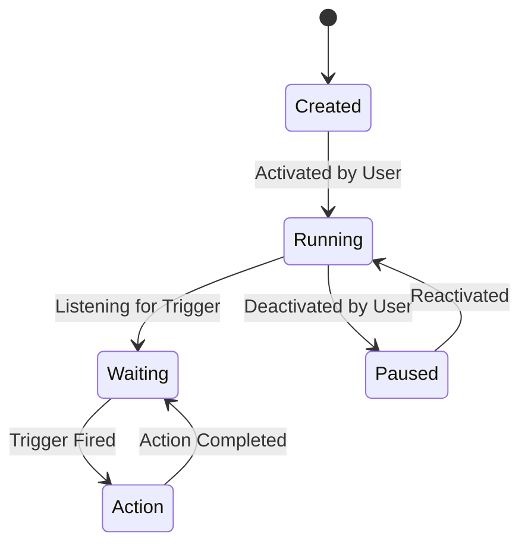

# Workflows & Temporal

> **Robust workflow orchestration powered by Temporal.io.**

The core of the AREA automation logic is built on **Temporal**, a durable execution engine that guarantees workflows run to completion even in the presence of failures.

## ⚙️ Core Concepts

### 1. Workflows
A **Workflow** defines the sequence of steps. In AREA, a workflow typically consists of:
- **Trigger**: Waiting for an event (or polling loop).
- **Condition**: Checking if the event data matches user criteria.
- **Action**: Executing an activity (e.g., API call).

### 2. Activities
**Activities** are the building blocks that perform side effects (like calling an external API). They are retried automatically on failure.
- *Example*: `sendDiscordWebhook`, `createGoogleEvent`.

### 3. Polling Service
For services that don't support webhooks (or where we use polling), we have a dedicated Polling Service.
- It runs periodically (e.g., every minute).
- Checks for state changes (e.g., "Has the latest email ID changed?").
- Signals the Workflow if a change is detected.

## 🔄 Workflow Lifecycle

## 🏗 Temporal Architecture in AREA

- **Worker**: `src/worker.ts` initializes the Temporal Worker which listens for tasks.
- **Client**: `src/temporal/temporal-client.service.ts` allows the NestJS API to start/stop workflows.

### Workflow V2 Controller (`workflows-v2.controller.ts`)
Manages the CRUD operations for user-defined workflows (AREAs).
- **Create**: Setup a new AREA.
- **Update**: Change triggers/actions.
- **Toggle**: specific endpoint to pause/resume.
