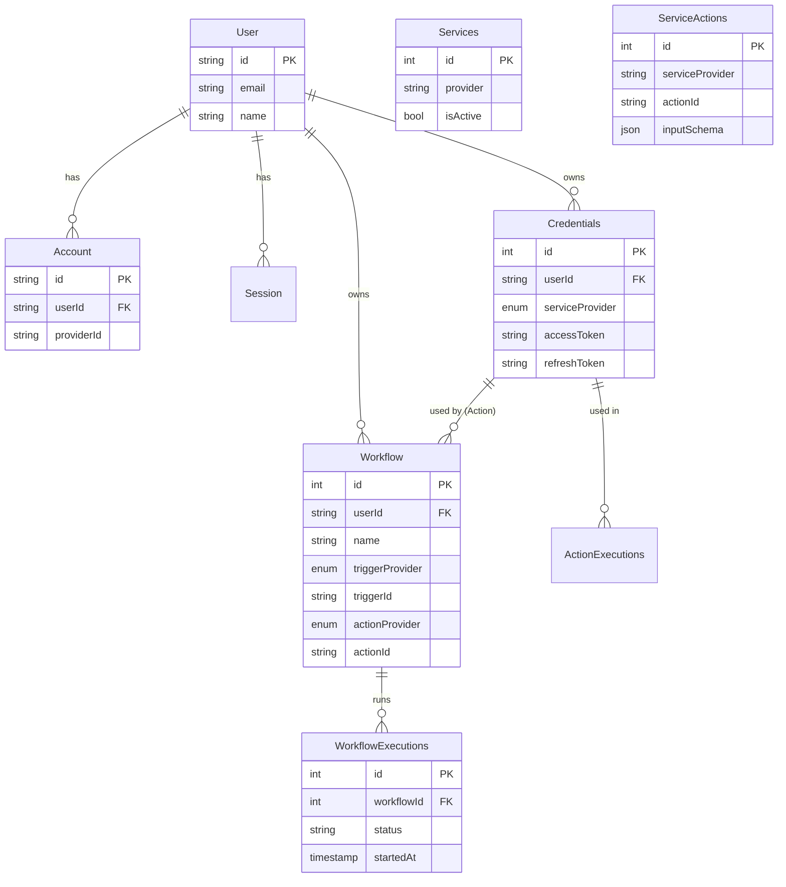

# Database Schema

> **Entity Relationship Diagram (ERD) and Schema Reference.**

The project uses **PostgreSQL** with **Drizzle ORM**.

## 🧬 Entity Relationship Diagram

## 📋 Tables Overview

- **User**: Core user identity (NextAuth compatible).
- **Credentials**: Stores encrypted OAuth2 tokens for external services.
- **Services**: Registry of active services and their supported features.
- **ServiceActions**: Definitions of available actions (inputs, outputs).
- **Workflows**: User-defined automation rules (Trigger -> Action).
- **WorkflowExecutions**: Audit log of every workflow run.
